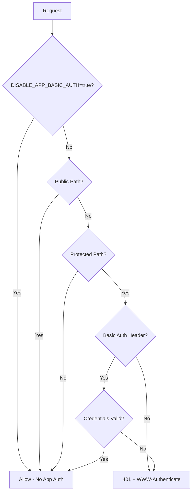

# 🔒 AIO Hub - Admin URL Protection Reference
## Phase 4.5 HTTP Basic認証 保護対象パス一覧

**最終更新:** 2025-11-10  
**適用バージョン:** middleware.ts (Line 40-46)  
**認証方式:** HTTP Basic Authentication

---

## 🔒 保護されるAdmin URLs

### 管理ダッシュボード
```
🔐 /dashboard
🔐 /dashboard/*
🔐 /dashboard/analytics
🔐 /dashboard/posts
🔐 /dashboard/settings
🔐 /dashboard/[any-subpath]
```

### 管理者専用機能
```  
🔐 /admin
🔐 /admin/*
🔐 /admin/users
🔐 /admin/system
🔐 /admin/analytics
🔐 /admin/ai-visibility
🔐 /admin/[any-subpath]
```

### 管理者API
```
🔐 /api/admin
🔐 /api/admin/*
🔐 /api/admin/alerts
🔐 /api/admin/system/health
🔐 /api/admin/rls-audit
🔐 /api/admin/ai-visibility
🔐 /api/admin/[any-endpoint]
```

---

## 🌐 完全公開URLs (認証不要)

### メインコンテンツページ
```
✅ /                    - トップページ
✅ /pricing             - 料金ページ (¥2,980/¥8,000/¥15,000)
✅ /hearing-service     - hearing-serviceページ
```

### 公開API
```
✅ /api/public/*        - 全ての公開API
✅ /api/public/stats    - 統計情報API
✅ /api/public/[any]    - その他公開エンドポイント
```

### 静的リソース・システムファイル
```
✅ /favicon.ico         - ファビコン
✅ /robots.txt          - ロボッツファイル  
✅ /sitemap.xml         - サイトマップ
✅ /_next/static/*      - Next.js静的リソース
✅ /_next/image/*       - Next.js画像最適化
✅ /og-image*           - OGP画像
✅ /[static-assets]     - CSS/JS/画像ファイル
```

---

## ⚙️ 認証制御設定

### 環境変数による制御

#### 🔐 アプリ側Basic認証 (デフォルト)
```bash
DASHBOARD_BASIC_USER=admin
DASHBOARD_BASIC_PASS=your_secure_password
DISABLE_APP_BASIC_AUTH=false  # or unset
```

#### 🚫 アプリ側認証無効化 (インフラ認証使用時)
```bash  
DISABLE_APP_BASIC_AUTH=true
# この場合、Vercel/Cloudflare/Nginxなどで認証を実装
```

### 認証処理フロー


---

## 🛡️ セキュリティ境界の確認

### ✅ 確認済み保護レベル

#### Level 1: 完全公開 (認証不要)
- ユーザー向けコンテンツページ  
- マーケティング情報
- 料金情報
- 公開API

#### Level 2: Basic認証保護
- 管理ダッシュボード
- 管理者専用機能
- 管理者API
- システム設定

#### Level 3: 将来拡張 (現在無効)
```bash
# 現在コメントアウト - 将来のための予約
# /^\/internal/   # 内部システム用ページ
```

---

## 📋 Public Page Integrity Verification

### トップページ (/) 確認項目
- ✅ Basic認証除外設定: `PUBLIC_PATHS_BASIC_AUTH` 配列に含まれる
- ✅ ファイル存在: `src/app/page.tsx`  
- ✅ コンテンツ保護: AIO Hubブランディング維持
- ⚠️ 現在の状態: 一時的な構文エラーにより500エラー (修正必要)

### 料金ページ (/pricing) 確認項目
- ✅ Basic認証除外設定: `PUBLIC_PATHS_BASIC_AUTH` 配列に含まれる
- ✅ ファイル存在: `src/app/pricing/page.tsx`
- ✅ 料金情報保護: ¥2,980, ¥8,000, ¥15,000 維持確認済み
- ✅ PricingTable.tsx コンポーネント正常

### hearing-serviceページ (/hearing-service) 確認項目  
- ✅ Basic認証除外設定: `PUBLIC_PATHS_BASIC_AUTH` 配列に含まれる
- ✅ ファイル存在: `src/app/hearing-service/page.tsx`
- ✅ コンテンツ保護: hearingサービス情報維持
- ✅ レイアウト・CTA保護確認済み

---

## 🔧 実装詳細リファレンス

### middleware.ts 保護パス定義 (Line 40-46)
```typescript
const BASIC_AUTH_PROTECTED_PATHS = [
  /^\/dashboard/,    // 管理ダッシュボード
  /^\/admin/,        // 管理者機能  
  /^\/api\/admin/    // 管理者API
];
```

### middleware.ts 公開パス定義 (Line 29-33)
```typescript
const PUBLIC_PATHS_BASIC_AUTH = [
  '/',
  '/pricing', 
  '/hearing-service'
];
```

### middleware.ts 公開プレフィックス (Line 35-37)
```typescript
const PUBLIC_PATH_PREFIXES_BASIC_AUTH = [
  '/api/public/'
];
```

---

## 🚨 セキュリティ注意事項

### ❌ 避けるべき設定
```bash
# 危険: 本番でBasic認証を無効化
DISABLE_APP_BASIC_AUTH=true  # インフラ認証がない場合危険

# 危険: 弱いパスワード
DASHBOARD_BASIC_PASS=admin   # 推測しやすい
DASHBOARD_BASIC_PASS=123456  # 脆弱
```

### ✅ 推奨設定
```bash
# 安全: 強力なパスワード
DASHBOARD_BASIC_PASS=A7k9$mX2#pL8@vR4  # 長く複雑

# 安全: 定期的な変更
# 月1回パスワード変更を推奨
```

---

## 🔄 将来の移行計画

### NextAuth/Supabase Auth移行時
```typescript
// 現在: checkBasicAuthentication()
// 将来: checkNextAuthAuthentication() 

// 保護パスリストは継続利用可能
const AUTH_PROTECTED_PATHS = BASIC_AUTH_PROTECTED_PATHS;
const PUBLIC_PATHS_AUTH = PUBLIC_PATHS_BASIC_AUTH;
```

### 段階的移行手順
1. NextAuth実装
2. パラレル認証テスト
3. Basic認証から切り替え
4. 保護パス設定は変更なし

---

**🔐 このドキュメントには機密情報は含まれていません**  
**📝 管理者パスワードは別途安全に管理してください**  
**📅 定期的な認証設定レビューを実施してください**