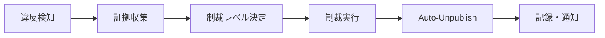

# Enforcement System Operations Manual

## 概要

AI Hub プラットフォームのユーザー制裁システム（Enforcement System）の運用マニュアル。管理者がユーザーの違反行為に対して適切な制裁措置を講じるためのガイドライン。

## システム構成

### Core Components

1. **Enforcement API** (`/api/enforcement/`)
   - `/actions/warn` - 警告の発行
   - `/actions/suspend` - アカウント一時停止
   - `/actions/freeze` - アカウント凍結
   - `/actions/reinstate` - アカウント復帰
   - `/actions/delete` - アカウント削除

2. **Auto-Unpublish System**
   - 制裁時の自動非公開化処理
   - Supabase RPC: `unpublish_org_public_content_for_user()`

3. **Admin Interface** (`/admin/enforcement`)
   - ユーザー検索・違反履歴確認
   - 制裁実行・履歴管理

## アカウントステータス

| Status | 日本語 | 説明 | 公開コンテンツ | ログイン |
|--------|--------|------|-------------|----------|
| `active` | 正常 | 通常のアクティブアカウント | ✅ 表示 | ✅ 可能 |
| `warned` | 警告中 | 警告を受けているが機能制限なし | ✅ 表示 | ✅ 可能 |
| `suspended` | 一時停止 | 期限付き停止、自動復帰可能 | ❌ 非表示 | ❌ 不可 |
| `frozen` | 凍結 | 手動復帰が必要な停止状態 | ❌ 非表示 | ❌ 不可 |
| `deleted` | 削除済み | 完全削除、復帰不可能 | ❌ 非表示 | ❌ 不可 |

## 制裁フロー

### 1. 基本的な制裁手順



### 2. 制裁レベルの判断基準

#### 軽微な違反 (Warning)
- 不適切なコンテンツの投稿
- コミュニティガイドラインの軽微な違反
- **アクション**: `warn` (デッドライン設定推奨)
- **期間**: 7-30日
- **効果**: 機能制限なし、警告記録のみ

#### 中程度の違反 (Suspension)
- 繰り返しの軽微な違反
- 利用規約の明確な違反
- **アクション**: `suspend` (デッドライン設定必須)
- **期間**: 1-90日
- **効果**: ログイン不可、公開コンテンツ非表示

#### 重大な違反 (Freeze)
- 悪質な行為の実行
- 他ユーザーへの迷惑行為
- **アクション**: `freeze` (手動復帰のみ)
- **期間**: 無期限（個別判断）
- **効果**: ログイン不可、公開コンテンツ非表示

#### 最重度違反 (Delete)
- 法的問題を伴う行為
- プラットフォームの信頼性を損なう行為
- **アクション**: `delete` (復帰不可能)
- **期間**: 永続
- **効果**: アカウント完全削除

## 運用手順

### 3.1 管理者による制裁実行

#### Step 1: Admin画面アクセス
```
URL: /admin/enforcement
認証: admin権限が必要
```

#### Step 2: ユーザー検索
```
検索方法:
- Email address
- Organization name  
- User ID (UUID)
```

#### Step 3: 違反履歴確認
```
確認項目:
- 過去の制裁履歴
- 現在のアカウントステータス
- 違反スコア・推奨アクション
```

#### Step 4: 制裁実行
```json
{
  "userId": "user-uuid-here",
  "message": "違反理由の詳細な説明",
  "deadline": "2025-12-31T23:59:59Z"  // suspend/freeze/warnのみ
}
```

### 3.2 API直接実行（開発・緊急時）

#### 警告発行
```bash
curl -X POST /api/enforcement/actions/warn \
  -H "Authorization: Bearer <admin-token>" \
  -H "Content-Type: application/json" \
  -d '{
    "userId": "target-user-uuid",
    "message": "コンテンツガイドライン違反のため警告します",
    "deadline": "2025-12-15T23:59:59Z"
  }'
```

#### アカウント停止
```bash
curl -X POST /api/enforcement/actions/suspend \
  -H "Authorization: Bearer <admin-token>" \
  -H "Content-Type: application/json" \
  -d '{
    "userId": "target-user-uuid", 
    "message": "利用規約違反により30日間停止します",
    "deadline": "2025-12-15T23:59:59Z"
  }'
```

#### アカウント復帰
```bash
curl -X POST /api/enforcement/actions/reinstate \
  -H "Authorization: Bearer <admin-token>" \
  -H "Content-Type: application/json" \
  -d '{
    "userId": "target-user-uuid",
    "message": "違反状態が改善されたため復帰処理を実行します"
  }'
```

## Auto-Unpublish システム

### 4.1 動作原理

制裁アクション実行時、以下の状態変更で自動的に公開コンテンツが非公開化：

| 制裁アクション | Auto-Unpublish実行 | 対象コンテンツ |
|-------------|------------------|-------------|
| `warn` | ❌ No | - |
| `suspend` | ✅ Yes | 全公開コンテンツ |
| `freeze` | ✅ Yes | 全公開コンテンツ |
| `delete` | ✅ Yes | 全公開コンテンツ |
| `reinstate` | ❌ No | - |

### 4.2 非公開化対象

```sql
-- 以下テーブルの is_published フラグが false に変更される
UPDATE organizations SET is_published = false WHERE created_by = [user_id];
UPDATE posts SET is_published = false WHERE created_by = [user_id];
UPDATE services SET is_published = false WHERE created_by = [user_id];
UPDATE case_studies SET is_published = false WHERE created_by = [user_id];
UPDATE faqs SET is_published = false WHERE created_by = [user_id];
```

### 4.3 ログ確認

Auto-unpublish の実行状況はログで確認可能：

```typescript
// 成功ログ
logger.info('auto_unpublish_success', {
  userId: 'xxx',
  component: 'enforcement-auto-unpublish',
  rpc_function: 'unpublish_org_public_content_for_user',
  result: 'public_content_unpublished'
});

// 失敗ログ  
logger.error('auto_unpublish_failed', {
  userId: 'xxx',
  error: 'error_message',
  component: 'enforcement-auto-unpublish',
  rpc_function: 'unpublish_org_public_content_for_user'
});
```

## デッドライン機能

### 5.1 自動復帰システム

`deadline` 設定のある制裁は自動的に復帰処理が実行される：

```sql
-- supabase/functions/process_enforcement_deadlines.sql
-- 毎日実行される定期処理でデッドライン到来アカウントを自動復帰
```

### 5.2 デッドライン設定ルール

| Action | デッドライン | 必須/任意 | 自動復帰 |
|--------|------------|---------|---------|
| `warn` | ✅ 可能 | 任意 | ✅ Yes |
| `suspend` | ✅ 可能 | **必須** | ✅ Yes |
| `freeze` | ✅ 可能 | 任意 | ✅ Yes |
| `reinstate` | ❌ 不可 | - | - |
| `delete` | ❌ 不可 | - | - |

## トラブルシューティング

### 6.1 よくある問題

#### 問題: Auto-unpublish が動作しない
```
確認項目:
1. Supabase RPC関数の存在確認
   SELECT * FROM pg_proc WHERE proname = 'unpublish_org_public_content_for_user';

2. ログでエラー確認
   component: 'enforcement-auto-unpublish' でフィルタ

3. RLS ポリシーの確認
   Service Role Key が正しく設定されているか
```

#### 問題: 制裁実行時に権限エラー
```
確認項目:
1. Admin認証の確認
   Authorization header が正しく設定されているか

2. 管理者権限の確認  
   profiles.role = 'admin' が設定されているか

3. Supabase環境変数の確認
   SUPABASE_SERVICE_ROLE_KEY が正しく設定されているか
```

#### 問題: デッドライン自動復帰が動作しない
```
確認項目:
1. Supabase Edge Functionsの実行状況確認
2. Cronジョブの設定確認
3. 時刻設定（UTC）の確認
```

### 6.2 緊急時対応

#### 即座にユーザーを停止したい場合
```bash
# 最も重い制裁（アカウント削除）を即座に実行
curl -X POST /api/enforcement/actions/delete \
  -H "Authorization: Bearer <admin-token>" \
  -H "Content-Type: application/json" \
  -d '{
    "userId": "emergency-user-uuid",
    "message": "緊急停止: 重大な利用規約違反のため即座に削除"
  }'
```

#### 誤って制裁をかけた場合
```bash
# 即座に復帰処理を実行
curl -X POST /api/enforcement/actions/reinstate \
  -H "Authorization: Bearer <admin-token>" \
  -H "Content-Type: application/json" \
  -d '{
    "userId": "mistaken-user-uuid",
    "message": "誤制裁のため復帰処理を実行"
  }'
```

## ユーザー復帰時の運用手順

### ⚠️ 重要: Auto-Republish は存在しない

AIOHub システムには **auto-republish** 機能は実装されていません。これは意図的な設計です。

#### 復帰時の手動作業が必要な理由
1. **コンテンツ品質確保**: 復帰前にコンテンツの適切性を再確認
2. **意図的な再公開**: ユーザー自身が公開意思を再確認
3. **段階的復帰**: 必要に応じて段階的なコンテンツ復帰が可能

### 復帰手順（Reinstate）

#### Step 1: アカウント状態の復帰
```bash
# API実行
curl -X POST /api/enforcement/actions/reinstate \
  -H "Authorization: Bearer <admin-token>" \
  -H "Content-Type: application/json" \
  -d '{
    "userId": "target-user-uuid",
    "message": "審査完了により復帰処理を実行"
  }'
```

#### Step 2: コンテンツ再公開の案内
ユーザーに以下の手順を案内：

1. **ダッシュボードにログイン**
   ```
   復帰後、ユーザーは通常通りログイン可能
   account_status = 'active' に変更されている
   ```

2. **組織管理画面でコンテンツ確認**
   ```
   /dashboard/organizations/[org-id]
   すべてのコンテンツが is_published = false の状態
   ```

3. **個別コンテンツの再公開**
   ```
   各コンテンツの編集画面で：
   - 内容の見直し・修正
   - 「公開する」ボタンをクリック
   - is_published = true に変更される
   ```

### 管理者側の復帰サポート

#### コンテンツ再公開状況の確認
```sql
-- 復帰ユーザーの公開状況確認
SELECT 
  'organizations' as content_type,
  COUNT(*) as total_count,
  COUNT(CASE WHEN is_published = true THEN 1 END) as published_count
FROM organizations 
WHERE created_by = '[user_id]'

UNION ALL

SELECT 
  'posts' as content_type,
  COUNT(*) as total_count, 
  COUNT(CASE WHEN is_published = true THEN 1 END) as published_count
FROM posts 
WHERE created_by = '[user_id]';
```

#### 一括再公開支援（緊急時のみ）

**注意**: 通常は推奨されませんが、緊急の場合のみ管理者が代行可能

```sql
-- 🚨 緊急時のみ: 管理者による一括再公開
-- ユーザー同意と内容確認が前提

-- 組織の再公開
UPDATE organizations 
SET is_published = true, updated_at = NOW()
WHERE created_by = '[user_id]' 
  AND status = 'published'  -- statusがpublishedのもののみ
  AND is_published = false;

-- 投稿の再公開  
UPDATE posts 
SET is_published = true, updated_at = NOW()
WHERE created_by = '[user_id]'
  AND status = 'published'
  AND is_published = false;
```

### 復帰プロセスのベストプラクティス

#### 1. 段階的復帰の推奨
```
Phase 1: アカウント復帰のみ
Phase 2: 重要コンテンツ（組織情報）の再公開
Phase 3: その他コンテンツの順次再公開
```

#### 2. 復帰理由の文書化
```
復帰時のメッセージ例:
- "規約違反状態が改善されたため復帰"
- "審査の結果、問題なしと判定"
- "一定期間経過により自動復帰"
```

#### 3. 復帰後のフォローアップ
```
1週間後: 再公開状況の確認
2週間後: 新規違反の有無確認  
1ヶ月後: 復帰ケースのレビュー
```

### よくある復帰時の問題

#### Q1: 復帰後もログインできない
```
確認事項:
1. account_status が 'active' になっているか
2. メールアドレスが有効か
3. パスワードリセットが必要か
```

#### Q2: コンテンツが表示されない
```
確認事項:
1. is_published が false のまま
2. status が 'draft' になっている
3. ユーザーが再公開手順を理解していない
```

#### Q3: 一部のコンテンツのみ復帰したい
```
対応方法:
1. ユーザーが個別に選択して再公開
2. 管理者が事前に対象を絞って通知
3. 段階的復帰スケジュールの提示
```

### 復帰通知テンプレート

#### ユーザー向け復帰通知メール
```
件名: アカウント復帰のお知らせ

いつもAIOHubをご利用いただき、ありがとうございます。

審査の結果、お客様のアカウントを復帰させていただきました。
今後は通常通りサービスをご利用いただけます。

■ 重要なお知らせ
制裁期間中に非公開となったコンテンツについては、
お客様ご自身での再公開作業が必要です。

■ 再公開手順
1. ダッシュボードにログイン
2. 組織管理画面でコンテンツを確認
3. 各コンテンツを個別に編集・再公開

ご質問がございましたら、お気軽にお問い合わせください。
```

## 重要な注意事項

### ⚠️ データベース関数の取り扱い

```
重要: unpublish_org_public_content_for_user() 関数について

- この関数はDB側で定義され、手動テスト済み
- 関数のSQL本体はDB側がソースオブトゥルース
- アプリケーション側で推測や別案で書き換え禁止
- 新しい仕様での再定義禁止
```

### ⚠️ 復帰時の重要事項

```
重要: 復帰プロセスについて

- Auto-republish 機能は存在しない（意図的設計）
- ユーザー自身による手動再公開が必須
- 管理者による一括再公開は緊急時のみ
- 段階的復帰を推奨
```

### ⚠️ 制裁の慎重な実行

```
制裁実行前の確認事項:
1. 証拠の十分性
2. 制裁レベルの妥当性  
3. デッドライン設定の適切性
4. 過去の制裁履歴との整合性
```

### ⚠️ ログ監視

```
必須監視ログ:
- component: 'enforcement-*' (全制裁アクション)
- component: 'enforcement-auto-unpublish' (自動非公開)
- error レベルの enforcement 関連ログ
```

## 関連ファイル

- **API実装**: `src/app/api/enforcement/actions/_shared.ts`
- **Admin UI**: `src/app/admin/enforcement/page.tsx` 
- **データベース**: `supabase/migrations/20251113_enforcement_system.sql`
- **デッドライン処理**: `supabase/migrations/20251114_add_auto_unpublish_to_deadlines.sql`
- **テストガイド**: `docs/ENFORCEMENT_TESTING.md`

---

**作成日**: 2025-11-14  
**バージョン**: 1.0  
**最終更新**: 2025-11-14