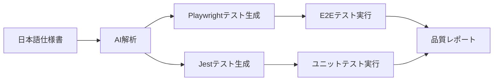

# AI-QA Ops 実装計画（Implementation Plan）

## 1. ゴール

### 最終目標
- **AIだけで開発しても、GitHub Actions / テスト / 監査AIによって本番が壊れない状態** を構築
- **人間1人でも1億ユーザー規模の運用に耐えられる自動化システム** の実現

### 具体的な成果物
- コード品質の自動監査システム
- 仕様書駆動の自動テスト生成
- プロジェクト全体のコンテキスト管理
- AI同士の相互監視による品質担保

---

## 2. 導入するコンポーネント一覧

### コンポーネント概要

| コンポーネント | 目的 | 実装技術 | 優先度 |
|---|---|---|---|
| **コンテキスト地図** | プロジェクト全体構造の可視化 | repomix + CONTEXT.md | 🔥 高 |
| **AI Gatekeeper** | コード変更の自動監査 | GitHub Actions + OpenAI | 🔥 高 |
| **Spec-Driven Testing** | 仕様書からの自動テスト生成 | Playwright + Jest | 🟡 中 |
| **外形監視** | 本番運用の異常検知 | Sentry + Datadog | 🟢 低 |

---

## 3. 各コンポーネントの詳細と TODO

### 3.1 コンテキスト地図（repomix + CONTEXT.md）

#### やりたいこと
- プロジェクト全体の構造をMarkdown形式で自動生成
- AIが常に最新のコードベース構造を把握できる状態を維持
- ファイル間の依存関係・設計思想の明文化

#### 想定コマンド
```bash
npm run map          # CONTEXT.md を生成
npm run map:update   # 差分更新（高速版）
npm run map:deep     # 詳細解析版
```

#### 実装TODO
- [ ] repomix のインストール・設定
- [ ] repomix.config.json の作成（除外フォルダ設定）
- [ ] package.json への map コマンド追加
- [ ] CONTEXT.md のテンプレート設計
- [ ] CI/CDパイプラインへの組み込み（PR時の自動更新）

#### 期待される効果
- AIが過去のコンテキストを失わない
- 新しいAIエージェントへの引き継ぎが容易
- コードベース理解の時間短縮（50%削減目標）

---

### 3.2 AI Gatekeeper（自動コードレビュー）

#### やりたいこと
- GitHub PRの差分を自動解析
- セキュリティ・パフォーマンス・設計整合性のチェック
- 重大な問題がある場合のマージブロック

#### 実装イメージ（`.github/workflows/ai-code-review.yml`）
```yaml
name: AI Gatekeeper
on: 
  pull_request:
    branches: [main]

jobs:
  ai-review:
    runs-on: ubuntu-latest
    steps:
      - name: Checkout code
        uses: actions/checkout@v4
      
      - name: Get PR diff
        run: |
          git diff origin/main...HEAD > pr-diff.txt
      
      - name: AI Security Review
        env:
          OPENAI_API_KEY: ${{ secrets.OPENAI_API_KEY }}
        run: |
          node scripts/ai-gatekeeper/security-review.js pr-diff.txt
      
      - name: AI Performance Review  
        run: |
          node scripts/ai-gatekeeper/performance-review.js pr-diff.txt
      
      - name: Create Review Comment
        uses: actions/github-script@v7
        with:
          script: |
            // レビュー結果をPRコメントに投稿
```

#### チェック項目
- **セキュリティ**: SQLインジェクション・XSS・認証バイパス
- **パフォーマンス**: N+1クエリ・メモリリーク・無限ループ  
- **RLS違反**: Supabase Row Level Security の破壊検出
- **UI破壊**: 重要なレイアウト・アクセシビリティの劣化

#### 実装TODO
- [ ] OpenAI API 連携スクリプトの作成
- [ ] セキュリティチェックルールセットの定義
- [ ] パフォーマンスチェックルールセットの定義
- [ ] GitHub Secrets への API キー設定
- [ ] レビューコメント自動投稿機能
- [ ] 重大問題検出時のマージブロック機能

---

### 3.3 Spec-Driven Testing（仕様書駆動テスト）

#### やりたいこと
- `/specs` ディレクトリの日本語仕様書から自動的にPlaywright/Jestテストを生成
- 重要ビジネスフローの確実なカバレッジ
- 仕様変更時の自動テスト更新

#### `/specs` ディレクトリ構造案
```
specs/
├── features/           # 機能仕様
│   ├── authentication.md
│   ├── dashboard.md
│   └── billing.md
├── flows/             # ユーザーフロー仕様
│   ├── user-onboarding.md
│   ├── payment-process.md
│   └── admin-operations.md
├── apis/              # API仕様
│   ├── auth-api.md
│   ├── user-api.md
│   └── billing-api.md
└── ui/                # UI仕様
    ├── components.md
    ├── layouts.md
    └── responsive.md
```

#### テスト生成フロー


#### 必須カバレッジ（重要フロー）
- **認証フロー**: ログイン → ダッシュボード表示 → ログアウト
- **課金フロー**: プラン選択 → 決済 → サービス有効化
- **管理機能**: 管理者ログイン → ユーザー管理 → 権限変更
- **コンテンツ操作**: 作成 → 編集 → 公開 → 削除

#### 実装TODO
- [ ] `/specs` ディレクトリの雛形作成
- [ ] 仕様書テンプレートの設計
- [ ] AI テスト生成スクリプトの開発
- [ ] 既存のPlaywright設定との統合
- [ ] CI/CDパイプラインへの組み込み

---

### 3.4 外形監視・SLO（将来計画）

#### やりたいこと
- 本番環境でのユーザー体験の常時監視
- パフォーマンス劣化・エラー率上昇の早期検知
- SLA/SLO に基づく自動アラート

#### 想定ツール
- **Sentry**: エラートラッキング・パフォーマンス監視
- **Datadog**: インフラ監視・ダッシュボード  
- **Lighthouse CI**: Core Web Vitals の自動計測
- **Uptime Robot**: 外形監視・死活監視

#### SLO設定案
- **可用性**: 99.9%（月間停止時間43分以下）
- **レスポンス時間**: 95%ile で2秒以内
- **エラー率**: 0.1%以下
- **Core Web Vitals**: すべて「良好」判定

#### 実装TODO（Phase 5で検討）
- [ ] Sentry プロジェクト設定
- [ ] Datadog 連携
- [ ] SLO定義・アラート設定
- [ ] インシデント対応 Runbook 作成

---

## 4. 優先順位・実装フェーズ

### Phase 1: ドキュメント整備（現在進行中）
**期間**: 1週間  
**担当**: AI（Claude Code）
- [x] AI-QA Ops 概要ドキュメント作成
- [x] 実装計画ドキュメント作成  
- [ ] `/specs` ディレクトリ雛形作成
- [ ] 仕様書テンプレート設計

### Phase 2: コンテキスト地図導入
**期間**: 1週間  
**担当**: AI（Claude Code）
- [ ] repomix インストール・設定
- [ ] CONTEXT.md 自動生成コマンド  
- [ ] CI/CDへの組み込み

### Phase 3: AI Gatekeeper 導入
**期間**: 2週間  
**担当**: AI（GPT-4o + Claude Code）
- [ ] OpenAI API 連携基盤構築
- [ ] セキュリティレビューロジック実装
- [ ] GitHub Actions ワークフロー作成
- [ ] 段階的な運用開始（警告のみ → ブロック）

### Phase 4: Spec-Driven Testing 導入  
**期間**: 2週間
**担当**: AI（Claude Code + Gemini）
- [ ] `/specs` 本格運用開始
- [ ] 重要フローの仕様書作成
- [ ] AI テスト生成システム実装
- [ ] 既存テストとの統合

### Phase 5: 外形監視・運用最適化
**期間**: 1週間
**担当**: 人間 + AI
- [ ] Sentry/Datadog 設定
- [ ] SLO/アラート設定  
- [ ] 運用体制の最終調整

---

## 5. リスク・制約事項

### 技術的制約
- **OpenAI API コスト**: 大量のコードレビューで費用増加の可能性
- **AI精度**: 完璧ではないため、人間による最終判断が必要
- **レスポンス時間**: AI処理でCI/CD時間が延長される可能性

### 運用制約
- **既存ワークフロー**: 現行の8つのGitHub Actionsとの衝突回避
- **学習曲線**: AI Gatekeeper の誤検知率調整に時間が必要
- **依存関係**: repomix等の外部ツールの安定性に依存

### 対策
- **段階導入**: まず警告のみ運用 → 徐々にブロック機能有効化
- **コスト管理**: OpenAI API の使用量上限設定
- **フォールバック**: AI処理失敗時は従来フローで継続

---

## 6. 成功指標（KPI）

### 開発効率
- [ ] コードレビュー時間: 50%削減（現在30分 → 15分）
- [ ] バグ検出時間: 80%短縮（現在3日 → 0.6日）
- [ ] 新機能開発サイクル: 30%短縮（現在2週間 → 1.4週間）

### 品質指標  
- [ ] 本番バグ検出率: 80%削減
- [ ] テストカバレッジ: E2E 80%以上維持
- [ ] パフォーマンス: Core Web Vitals 90点以上維持

### 運用指標
- [ ] デプロイ成功率: 99%以上
- [ ] ロールバック時間: 30分以内
- [ ] インシデント対応時間: 平均30分以内

---

## 7. メモ・備考

### 現在の位置づけ
- **設計・方針フェーズ**: 実装より先に思想・アーキテクチャを固める
- **段階的導入**: 一気に全て導入せず、1つずつ検証しながら進める
- **既存尊重**: 現在稼働中のシステムを壊さない前提で追加構築

### 実装タイミング
- **Supabase改修完了後**: 現在のTypeScriptエラー解決・RLS調整が優先
- **コードベース安定後**: 大きな変更が落ち着いてから本格導入
- **段階的ロールアウト**: 開発環境 → ステージング → 本番の順で展開

### 他プロジェクトへの応用
- この AI-QA Ops の仕組みは他のプロジェクトにも水平展開可能
- 特に「人間少数 + AI多数」の開発体制で威力を発揮
- オープンソース化も将来的に検討可能

---

*本実装計画は AIOHub プロジェクトの AI-QA Ops 実現に向けた具体的なロードマップです。各フェーズの進捗に応じて随時更新していきます。*