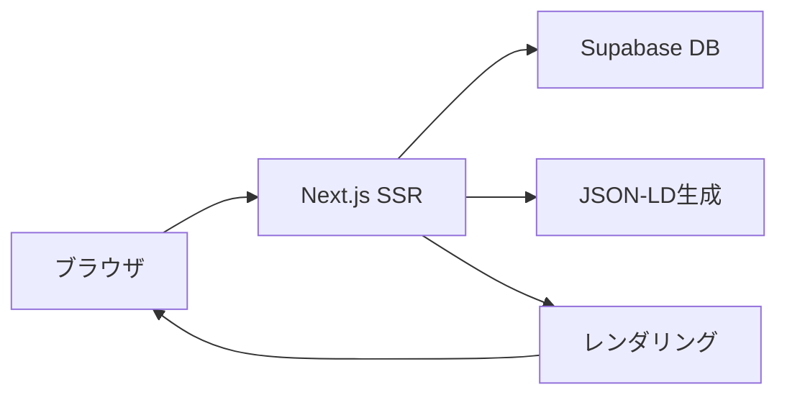
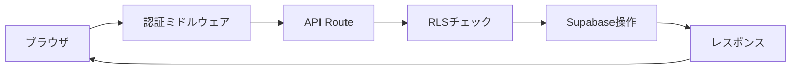
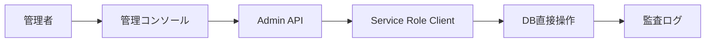

# AIOHub 現状仕様書（As-Is Specification）

## 1. 概要（Overview）

### 1.1 システム概要
AIOHubは「AIに正しく理解されるためのCMS」として開発されたNext.js 15ベースのWebアプリケーションです。企業情報を構造化データ形式で公開し、AIや検索エンジンが適切に理解できる形式での情報発信を支援します。

### 1.2 技術スタック
- **フロントエンド**: Next.js 15 (App Router) + TypeScript + Tailwind CSS
- **バックエンド**: Supabase (PostgreSQL + Auth + Storage + Edge Functions)
- **認証**: Supabase Auth + ミドルウェアベース認可
- **テスト**: Playwright (E2E) + Jest (Unit/Integration)
- **CI/CD**: GitHub Actions
- **外部連携**: Stripe (決済), Resend (メール送信)

### 1.3 開発・運用体制
- **開発方針**: 人間1人 + 複数AI（Claude Code, Gemini等）による開発
- **言語**: 日本語中心（仕様書・設計書・運用）、英語（コード・変数名）
- **品質管理**: 段階的防御（実装→監査→テスト）を想定

---

## 2. アーキテクチャ（Architecture）

### 2.1 ディレクトリ構造
```
src/
├── app/                     # Next.js App Router
│   ├── (auth)/             # 認証関連ルート
│   ├── admin/              # 管理者機能
│   ├── management-console/ # 管理コンソール
│   ├── organizations/      # 組織ページ（公開）
│   ├── my/                # ユーザー専用機能
│   ├── api/               # API エンドポイント
│   └── ...                # 各種ページ
├── components/            # React コンポーネント
├── lib/                   # 共通ライブラリ
├── hooks/                 # カスタムフック
├── types/                 # TypeScript型定義
├── config/                # 設定ファイル
└── middleware/            # ミドルウェア
```

### 2.2 データベース設計
主要テーブル（Supabase PostgreSQL）:
- **organizations**: 組織情報
- **services**: サービス情報
- **case_studies**: 導入事例
- **faqs**: FAQ
- **posts**: 記事・ブログ
- **qa_entries**: Q&A項目
- **users**: ユーザー情報
- **user_segments**: ユーザーセグメント（課金プラン管理）

### 2.3 認証・認可
- **認証**: Supabase Auth（メール/パスワード + OAuth）
- **認可**: RLS（Row Level Security） + ミドルウェア
- **セッション管理**: SSR対応のCookie管理（@supabase/ssr v2）

---

## 3. 機能一覧（Feature List）

### 3.1 公開ページ機能

#### 3.1.1 ランディングページ（/）
- **HeroSection**: メインビジュアル・キャッチコピー
- **FlowSection**: 利用フロー説明
- **PricingSection**: 料金プラン表示
- **CTASection**: アクション誘導
- **FAQSection**: よくある質問

#### 3.1.2 組織ページ（/organizations）
- **企業一覧**: フィルタリング・検索機能
- **企業詳細**: 組織情報・サービス・FAQ・導入事例表示
- **JSON-LD出力**: 構造化データ自動生成
- **埋め込み対応**: iframe・widget形式での外部埋め込み

#### 3.1.3 その他公開ページ
- **/hearing-service**: ヒアリング代行サービス紹介
- **/pricing**: 料金プラン詳細
- **/about**: サービス概要
- **/contact**: お問い合わせ
- **/privacy, /terms**: 利用規約・プライバシーポリシー

### 3.2 ユーザー機能

#### 3.2.1 認証機能
- **ユーザー登録**: メール認証付き
- **ログイン**: メール/パスワード + OAuth（GitHub, Google等）
- **パスワード変更**: セキュア更新機能
- **メール確認再送信**: 未確認ユーザー向け

#### 3.2.2 マイページ機能（/my/）
- **組織管理**: 組織情報編集・ロゴアップロード
- **サービス管理**: サービス登録・編集・削除
- **FAQ管理**: FAQ作成・編集・公開設定
- **導入事例管理**: 事例登録・編集・公開設定
- **記事管理**: ブログ記事作成・編集・公開
- **営業資料管理**: ファイルアップロード・ダウンロード
- **Q&A管理**: カテゴリ・エントリ管理
- **統計表示**: アクセス解析・利用状況

#### 3.2.3 ダッシュボード（/dashboard）
- **統計概要**: 組織・サービス・コンテンツ数
- **最近の活動**: 更新履歴・アクセス状況
- **通知**: システム通知・アップデート情報
- **クイックアクション**: 主要機能へのリンク

### 3.3 管理機能

#### 3.3.1 管理コンソール（/management-console）
- **ユーザー管理**: 全ユーザー表示・セグメント管理
- **セキュリティ**: アクセスログ・異常検知
- **コンタクト管理**: お問い合わせ対応
- **ヒアリング管理**: ヒアリング申し込み対応
- **設定管理**: システム設定・機能フラグ

#### 3.3.2 管理者機能（/admin）
- **組織グループ管理**: 企業グルーピング・権限管理
- **機能管理**: 機能フラグ・プラン制限設定
- **課金管理**: Stripe連携・プラン管理
- **システム監視**: ヘルスチェック・エラーログ
- **CMS管理**: コンテンツ・アセット管理

### 3.4 API機能

#### 3.4.1 公開API（/api/public）
- **組織データ**: JSON-LD・構造化データ出力
- **埋め込み**: iframe・widget用データ
- **検索**: 組織・サービス検索
- **統計**: 公開統計データ
- **サイトマップ**: SEO用サイトマップ生成

#### 3.4.2 認証API（/api/my, /api/user）
- **CRUD操作**: 各種リソースの作成・更新・削除
- **ファイル操作**: アップロード・ダウンロード
- **統計取得**: ユーザー向けアナリティクス
- **設定管理**: ユーザー設定・プリファレンス

#### 3.4.3 管理API（/api/admin）
- **ユーザー管理**: セグメント変更・権限付与
- **システム管理**: 機能フラグ・設定変更
- **課金管理**: プラン変更・請求処理
- **監視**: システムヘルス・パフォーマンス

#### 3.4.4 診断API（/api/diag）
- **ヘルスチェック**: システム各部の動作確認
- **認証状態**: セッション・権限確認
- **データベース**: 接続・クエリ確認
- **外部連携**: Stripe・Resend接続確認

---

## 4. プラン・制限マトリックス（Plan Matrix）

### 4.1 プラン種別
| プラン | 月額料金 | 期間制限 |
|-------|---------|---------|
| **Trial** | ¥0 | 14日間 |
| **Starter** | ¥2,980 | なし |
| **Pro** | ¥8,000 | なし |
| **Business** | ¥15,000 | なし |
| **Enterprise** | ¥30,000〜 | なし |

### 4.2 機能制限マトリックス
| 機能 | Trial | Starter | Pro | Business | Enterprise |
|------|-------|---------|-----|----------|------------|
| **サービス登録** | 5件 | 5件 | 20件 | 無制限 | 無制限 |
| **Q&A項目** | 10件 | 10件 | 50件 | 無制限 | 無制限 |
| **導入事例** | 5件 | 5件 | 20件 | 無制限 | 無制限 |
| **記事** | 10件 | 10件 | 100件 | 無制限 | 無制限 |
| **FAQ** | 10件 | 10件 | 50件 | 無制限 | 無制限 |
| **営業資料** | 10個 | 10個 | 10個 | 無制限 | 無制限 |
| **埋め込み** | 1個 | 1個 | 5個 | 20個 | 無制限 |
| **AIレポート** | ❌ | ❌ | ✅ | ✅（拡張） | ✅（拡張） |
| **Verifiedバッジ** | ❌ | ❌ | ❌ | ✅ | ✅ |
| **システム監視** | ❌ | ❌ | ❌ | ✅ | ✅ |
| **チーム管理** | ❌ | ❌ | ❌ | ✅ | ✅ |
| **承認フロー** | ❌ | ❌ | ❌ | ✅ | ✅ |

---

## 5. モジュール詳細（Module Specifications）

### 5.1 認証モジュール
**場所**: `src/lib/supabase/`, `src/middleware.ts`
**機能**:
- Supabase Auth連携
- SSRセッション管理（@supabase/ssr v2）
- ルートレベル認可（ミドルウェア）
- RLS権限制御

**主要ファイル**:
- `src/lib/supabase/client.ts`: ブラウザクライアント
- `src/lib/supabase/server.ts`: サーバークライアント  
- `src/middleware.ts`: 認証・認可ミドルウェア

### 5.2 プラン管理モジュール
**場所**: `src/config/plans.ts`
**機能**:
- プラン定義・制限管理
- 機能ゲート制御
- 利用状況チェック

**主要関数**:
```typescript
isServiceLimitReached(planType, currentCount): boolean
isQALimitReached(planType, currentCount): boolean
isPaidPlan(planType): boolean
```

### 5.3 組織管理モジュール
**場所**: `src/app/organizations/`, `src/app/my/organization/`
**機能**:
- 組織CRUD操作
- 公開設定管理
- JSON-LD生成

### 5.4 埋め込みモジュール
**場所**: `src/components/embed/`, `src/app/api/public/embed/`
**機能**:
- iframe埋め込みコード生成
- widget形式での外部埋め込み
- カスタムスタイル対応

### 5.5 CMS/コンテンツ管理モジュール
**場所**: `src/app/my/`, `src/components/forms/`
**機能**:
- サービス・FAQ・導入事例管理
- 記事・ブログ管理
- 営業資料ファイル管理
- 公開・下書き状態管理

### 5.6 診断・監視モジュール
**場所**: `src/app/api/diag/`
**機能**:
- システムヘルスチェック
- データベース接続確認
- 外部連携状態確認
- パフォーマンス監視

---

## 6. 認証・セキュリティ（Auth & Security）

### 6.1 認証フロー
1. **ユーザー登録**: メール認証必須
2. **ログイン**: メール/パスワード または OAuth
3. **セッション管理**: HttpOnly Cookie + JWT
4. **権限確認**: RLS + ミドルウェア二重チェック

### 6.2 Row Level Security（RLS）
主要ポリシー:
- **organizations**: 所有者のみ編集可能、公開済み組織は全員閲覧可能
- **services**: 組織所有者のみCRUD可能
- **users**: 本人のみ編集可能、管理者は全て閲覧可能

### 6.3 セキュリティ機能
- **CSRFトークン**: フォーム送信保護
- **レート制限**: API呼び出し制限（今後実装予定）
- **入力検証**: XSS・SQLインジェクション対策
- **ファイルアップロード**: 拡張子・サイズ制限

### 6.4 プライバシー保護
- **個人情報暗号化**: 機密データのハッシュ化
- **データ削除**: GDPR対応削除機能
- **アクセスログ**: 監査証跡の記録

---

## 7. データフロー（Data Flow）

### 7.1 公開ページアクセス


### 7.2 認証済みユーザーアクション


### 7.3 管理者操作


---

## 8. 既知の課題・制約事項（Known Issues）

### 8.1 技術的制約
- **TypeScript errors**: 19件のコンパイルエラーが残存（主にFAQページ、Dashboardコンポーネント）
- **レガシーコード**: 一部で古いSupabase v1パターンが混在
- **パフォーマンス**: 大量データでのN+1クエリ問題の可能性

### 8.2 機能的制約
- **AI機能**: 計画段階（AI可視性レポート、AI監査等）
- **外形監視**: Sentry/Datadog未導入
- **国際化**: 日本語のみ、多言語対応未実装
- **モバイル最適化**: レスポンシブ対応は基本レベル

### 8.3 運用制約
- **自動テスト**: E2Eテスト未整備、Jestテストも最小限
- **CI/CD**: 8つのGitHub Actionsワークフロー、複雑化傾向
- **監視**: 基本的なヘルスチェックのみ、本格監視なし

---

## 9. 未実装・計画中機能（Missing Parts）

### 9.1 AI-QA Ops関連（計画段階）
- **コンテキスト地図**: repomix + CONTEXT.md自動生成
- **AI Gatekeeper**: GitHub Actions + OpenAIによる自動コードレビュー
- **Spec-Driven Testing**: 仕様書駆動の自動テスト生成

### 9.2 監視・運用自動化
- **Sentry**: エラートラッキング
- **Datadog**: インフラ監視・パフォーマンス監視
- **Lighthouse CI**: Core Web Vitals自動計測

### 9.3 機能拡張予定
- **Search Console連携**: SEO詳細分析
- **AI可視性レポート**: AIクロール状況分析
- **ホワイトラベル**: Enterprise向け完全カスタマイズ
- **API優先アクセス**: 開発者向けAPIプラン

---

## 10. 付録（Appendix）

### 10.1 主要設定ファイル
- **next.config.js**: Next.js設定
- **tailwind.config.js**: スタイル設定
- **playwright.config.ts**: E2Eテスト設定
- **jest.config.js**: ユニットテスト設定

### 10.2 環境変数
必須環境変数:
- `NEXT_PUBLIC_SUPABASE_URL`: Supabase URL
- `NEXT_PUBLIC_SUPABASE_ANON_KEY`: Supabase匿名キー
- `SUPABASE_SERVICE_ROLE_KEY`: Supabase管理者キー
- `STRIPE_SECRET_KEY`: Stripe秘密キー
- `RESEND_API_KEY`: メール送信API キー

### 10.3 デプロイ・運用
- **Vercel**: 本番デプロイ環境
- **Supabase**: データベース・認証・ストレージ
- **GitHub Actions**: CI/CD パイプライン

---

## 結論

AIOHubは現在、基本的なCMS機能・認証機能・プラン管理機能が動作する状態ですが、AI-QA Opsによる完全自動化開発体制はまだ計画段階です。今後はTypeScriptエラーの解決、AI監査システムの導入、本格的な監視体制の構築を段階的に進めていく予定です。

**現在の完成度**: 約47.5%（基本機能は動作、AI-QA Ops・監視機能は未実装）

---

*作成日: 2024年11月25日*  
*対象バージョン: AIOHub v1.0 Current State*  
*最終更新: コンテキスト地図生成時に随時更新予定*