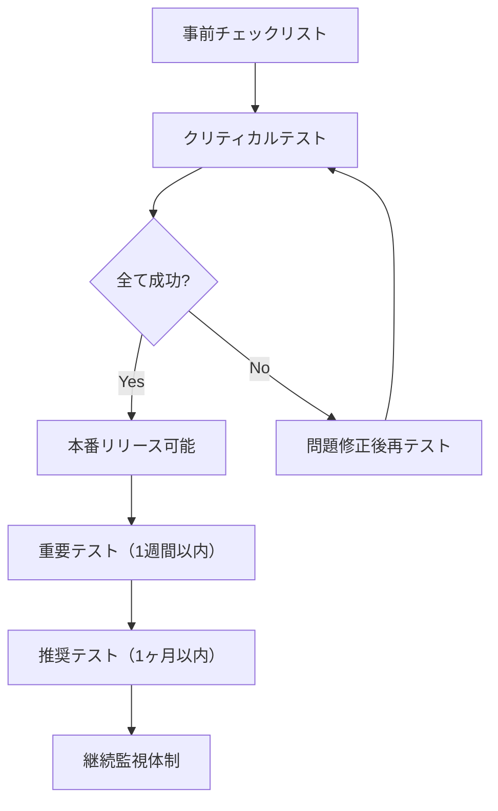

# 🔬 AIO Hub 実務テスト手順書【最終版】

## 📋 UAT実行全体フロー



---

## 🚨 ステップ1: 本番運用開始前チェックリスト（必須）

### 環境設定確認
```bash
# 本番環境変数確認（.env.production）
- [ ] NEXTAUTH_URL = https://aiohub.jp
- [ ] NEXTAUTH_SECRET = [セキュアな値設定済み]
- [ ] STRIPE_SECRET_KEY = sk_live_... [本番キー]
- [ ] STRIPE_WEBHOOK_SECRET = whsec_... [本番Webhook]
- [ ] RESEND_API_KEY = re_... [本番認証済み]
- [ ] NEXT_PUBLIC_SUPABASE_URL = [本番URL]
- [ ] NEXT_PUBLIC_SUPABASE_ANON_KEY = [本番キー]
```

### セキュリティ確認
```sql
-- Supabase SQLエディタで実行
- [ ] RLS有効化確認: SELECT schemaname, tablename, rowsecurity FROM pg_tables WHERE schemaname = 'public';
- [ ] 認証設定確認: Supabase Auth > Settings > Auth configurations
- [ ] CORS設定確認: https://aiohub.jp のみ許可されているか
- [ ] SSL証明書: https://aiohub.jp が正常にSSL表示されるか
```

### ドメイン・インフラ確認
```bash
- [ ] DNS設定: aiohub.jp → Vercelの正常解決
- [ ] Resendドメイン認証: noreply@aiohub.jp 送信可能
- [ ] Stripe Webhook: https://aiohub.jp/api/stripe/webhook 疎通確認
- [ ] Vercel本番デプロイ: 最新コードが反映済み
```

---

## 🔴 ステップ2: クリティカルテスト（本番リリース前必須）

> **⚠️ これらが全て成功するまで本番リリース禁止**

### テスト2-1: 基本認証フロー（所要時間: 10分）
```javascript
// 使用データ
email: "critical-test@luxucare.jp"  // 実在するメールアドレス
password: "CriticalTest123!"
```

**実行手順:**
1. https://aiohub.jp/auth/signup でアカウント作成
2. **確認**: 5分以内にメール受信
3. メール確認リンククリック → ダッシュボード遷移
4. **確認**: 「ようこそ」メッセージ表示
5. ログアウト → ログイン → 正常アクセス

**成功基準:**
- メール送信: 30秒以内
- ページ遷移: 3秒以内
- セッション維持: 24時間有効

### テスト2-2: 企業作成→公開フロー（所要時間: 15分）
```javascript
// テストデータ
organization = {
  name: "クリティカルテスト株式会社",
  description: "本番環境での基本動作確認用企業",
  url: "https://critical-test.example.com",
  telephone: "03-0000-0000",
  addressRegion: "東京都",
  addressLocality: "千代田区"
}
```

**実行手順:**
1. ダッシュボードで「新規企業追加」
2. 上記データ入力 → 保存
3. **確認**: 企業詳細ページ表示
4. 「公開管理」タブ → 法的同意チェック → 公開実行
5. **確認**: `/o/[slug]` で公開ページ表示
6. **確認**: JSON-LD構造化データ出力

**成功基準:**
- データ保存: エラーなし
- 公開ページ: 3秒以内表示
- SEO: JSON-LD正常出力

### テスト2-3: 決済完了→サブスクリプション有効化（所要時間: 10分）
```javascript
// Stripe テストカード（本番環境では小額実決済推奨）
card = "4242 4242 4242 4242"
expiry = "12/34" 
cvc = "123"
amount = "100円" // 最小課金額でテスト
```

**実行手順:**
1. 企業詳細 → 「サブスクリプション管理」
2. 「初期費用なしプラン」選択
3. Stripe Checkout → 上記カード情報入力
4. **確認**: 決済完了 → ダッシュボードリダイレクト
5. **確認**: subscription_status = 'active'

**成功基準:**
- 決済処理: 60秒以内完了
- Webhook: 30秒以内にDB更新
- ステータス: 'active'に変更

### テスト2-4: セキュリティ基本確認（所要時間: 5分）
```sql
-- RLS動作確認
-- 他のユーザーの企業データにアクセス試行
SELECT * FROM organizations WHERE user_id != auth.uid();
-- 結果: 0 rows (アクセス拒否されることを確認)
```

**実行手順:**
1. ブラウザ開発者ツールでSQL実行試行
2. **確認**: RLSにより他社データアクセス拒否
3. URLパラメータ改ざん試行: `/dashboard/organizations/他社ID`
4. **確認**: 403エラーまたはリダイレクト
5. XSSパターン入力: `<script>alert('test')</script>`
6. **確認**: スクリプト実行されず、適切にエスケープ

**成功基準:**
- 他社データ: 完全アクセス拒否
- XSS防止: スクリプト実行なし
- 認証要求: 未ログイン時適切リダイレクト

---

## 🟡 ステップ3: 重要テスト（リリース後1週間以内）

### テスト3-1: 全CRUD操作詳細確認（所要時間: 45分）

#### サービス管理
```javascript
service = {
  name: "AIデータ分析サービス",
  summary: "機械学習を活用したビジネスデータ分析サービス",
  features: ["予測分析", "データビジュアル", "レポート自動生成"],
  category: "データ分析",
  price: "月額30,000円〜"
}
```

**実行手順:**
1. サービス作成 → 編集 → 削除の一連操作
2. **確認**: 各操作でリアルタイムDB反映
3. **確認**: 公開ページでの表示更新

#### FAQ管理
```javascript
faqs = [
  {q: "導入期間はどのくらいですか？", a: "通常2-3週間です。"},
  {q: "サポート体制は？", a: "平日9-18時で対応します。"},
  {q: "料金プランは？", a: "月額制で3つのプランがあります。"}
]
```

#### 導入事例管理
```javascript
caseStudy = {
  title: "製造業A社の業務効率化",
  clientType: "製造業（従業員500名）",
  problem: "手作業での品質管理による工数増加",
  solution: "AI画像解析による自動品質判定システム導入",
  outcome: "品質管理工数を60%削減、不良品発見率向上",
  metrics: {"工数削減": "60%", "精度向上": "95%"}
}
```

### テスト3-2: 権限別アクセス制御（所要時間: 30分）

#### テストユーザー作成
```sql
-- Supabase Auth で以下のユーザーを事前作成
-- admin@luxucare-test.jp / TestAdmin123!
-- editor@luxucare-test.jp / TestEditor123!  
-- viewer@luxucare-test.jp / TestViewer123!

-- 権限設定（実際のUUIDに置換）
INSERT INTO public.users (id, email, role, name) VALUES
('[実際のUUID1]', 'admin@luxucare-test.jp', 'admin', '管理者テスト'),
('[実際のUUID2]', 'editor@luxucare-test.jp', 'editor', '編集者テスト'),
('[実際のUUID3]', 'viewer@luxucare-test.jp', 'viewer', '閲覧者テスト');
```

#### 権限マトリックス確認
| 操作 | Admin | Editor | Viewer | 確認方法 |
|------|-------|--------|--------|----------|
| 企業作成 | ✅ | ✅ | ❌ | ボタン表示・API応答 |
| 企業編集 | ✅ | ✅ | ❌ | 編集フォーム表示 |
| 企業削除 | ✅ | ❌ | ❌ | 削除ボタン表示 |
| 公開/非公開 | ✅ | ✅ | ❌ | 公開管理タブ |
| ユーザー管理 | ✅ | ❌ | ❌ | 管理メニュー表示 |
| システム設定 | ✅ | ❌ | ❌ | 設定ページアクセス |

### テスト3-3: メール通知全パターン（所要時間: 20分）

#### ウェルカムメール
```javascript
// 確認項目
subject: "AIO Hubへようこそ"
from: "noreply@aiohub.jp"
content: {
  greeting: "○○様", // ユーザー名表示
  introduction: "サービス概要説明",
  cta: "ダッシュボードへ",
  footer: "配信停止リンク"
}
```

#### 決済関連メール
```javascript
// 決済完了通知
subject: "サブスクリプション開始のお知らせ"
content: {
  plan: "プラン名表示",
  amount: "金額表示", 
  next_billing: "次回請求日"
}

// 決済失敗通知  
subject: "決済処理に失敗しました【重要】"
content: {
  error_reason: "失敗理由",
  retry_link: "再試行リンク",
  support_contact: "サポート連絡先"
}
```

### テスト3-4: データ整合性確認（所要時間: 15分）

#### 関連データ削除確認
```sql
-- 企業削除時の関連データ処理確認
-- 1. テスト企業にサービス・FAQ・事例を作成
-- 2. 企業削除実行
-- 3. 以下SQLで関連データ削除確認

SELECT 
  (SELECT COUNT(*) FROM services WHERE organization_id = '[削除した企業ID]') as services_count,
  (SELECT COUNT(*) FROM faqs WHERE organization_id = '[削除した企業ID]') as faqs_count,
  (SELECT COUNT(*) FROM case_studies WHERE organization_id = '[削除した企業ID]') as case_studies_count;
-- 結果: 全て0であることを確認
```

#### ユーザー削除時の所有権移譲
```sql
-- ユーザー削除時の企業所有権確認
-- 1. 共同管理者がいる企業を作成
-- 2. 元管理者を削除
-- 3. 企業が適切に管理者変更されることを確認

SELECT o.name, u.email as current_owner
FROM organizations o
JOIN users u ON o.user_id = u.id
WHERE o.id = '[テスト企業ID]';
```

---

## 🟢 ステップ4: 推奨テスト（リリース後1ヶ月以内）

### テスト4-1: パフォーマンス監視（所要時間: 30分）

#### Core Web Vitals測定
```javascript
// Lighthouse CI または手動測定
targets = {
  LCP: "< 2.5秒",    // Largest Contentful Paint
  FID: "< 100ms",    // First Input Delay  
  CLS: "< 0.1",      // Cumulative Layout Shift
  FCP: "< 1.8秒",    // First Contentful Paint
  TTI: "< 3.8秒"     // Time to Interactive
}

// 測定ページ
pages = [
  "https://aiohub.jp/",
  "https://aiohub.jp/organizations", 
  "https://aiohub.jp/search",
  "https://aiohub.jp/o/[sample-org]"
]
```

#### データベースパフォーマンス
```sql
-- Supabase Dashboard > Settings > Database で確認
-- 1. 接続数: < 60% (推奨)
-- 2. CPU使用率: < 70% (推奨)  
-- 3. メモリ使用率: < 80% (推奨)
-- 4. ストレージ使用量確認

-- スロークエリ確認
SELECT query, mean_time, calls
FROM pg_stat_statements 
ORDER BY mean_time DESC 
LIMIT 10;
```

### テスト4-2: SEO構造化データ検証（所要時間: 20分）

#### Google Search Console確認
```bash
# 1. Google Search Console にプロパティ追加
# 2. サイトマップ送信: https://aiohub.jp/sitemap.xml
# 3. 構造化データテスト: https://search.google.com/test/rich-results

# 確認項目
- [ ] Organization schema正常
- [ ] Service schema正常  
- [ ] FAQ schema正常
- [ ] CaseStudy schema正常
- [ ] パンくずリスト正常
```

#### JSON-LD検証
```javascript
// 各ページで開発者ツール > Elements で確認
document.querySelectorAll('script[type="application/ld+json"]').forEach((script, index) => {
  console.log(`Schema ${index + 1}:`, JSON.parse(script.textContent));
});

// 確認項目
- 空値が適切に除外されている
- E.164電話番号形式
- 必須プロパティ存在
- エラーなし
```

### テスト4-3: エラーハンドリング確認（所要時間: 25分）

#### ネットワークエラー確認
```javascript
// Chrome DevTools > Network > Offline でテスト
scenarios = [
  "オフライン時の適切なエラー表示",
  "API遅延時のローディング状態",
  "画像読み込み失敗時のフォールバック",
  "決済プロバイダー障害時の案内"
]
```

#### データ検証エラー
```javascript
// 異常なデータ入力でのエラーハンドリング
test_cases = [
  {field: "email", value: "invalid-email", expect: "適切なエラーメッセージ"},
  {field: "telephone", value: "abc", expect: "数字のみ入力要求"},  
  {field: "url", value: "not-a-url", expect: "URL形式エラー"},
  {field: "description", value: "a".repeat(5001), expect: "文字数制限エラー"}
]
```

### テスト4-4: 運用監視設定（所要時間: 40分）

#### Vercel Analytics設定
```bash
# Vercel Dashboard > Project > Analytics で確認
- [ ] ページビュー追跡有効
- [ ] パフォーマンス監視有効
- [ ] 地域別アクセス分析
- [ ] デバイス別分析
- [ ] アラート設定（異常時通知）
```

#### Supabase監視設定
```bash
# Supabase Dashboard > Settings > General で確認  
- [ ] 使用量アラート設定（80%で通知）
- [ ] バックアップ設定確認（ポイントインタイム復旧）
- [ ] ログ保持期間設定
- [ ] API制限値確認
```

#### Stripe監視設定
```bash
# Stripe Dashboard > Developers > Webhooks で確認
- [ ] Webhook配信成功率 > 95%
- [ ] 失敗時の再試行設定
- [ ] 異常取引の監視ルール
- [ ] 請求失敗アラート設定
```

#### Resend監視設定  
```bash
# Resend Dashboard > Analytics で確認
- [ ] 配信成功率 > 98%
- [ ] バウンス率 < 2%
- [ ] スパム報告率 < 0.1%
- [ ] ドメイン評価スコア > 80
```

---

## 📊 最終チェックリスト

### 🔴 クリティカル（必須）
- [ ] 基本認証フロー: 成功
- [ ] 企業作成→公開: 成功  
- [ ] 決済→サブスクリプション: 成功
- [ ] セキュリティ基本確認: 成功

### 🟡 重要（1週間以内）
- [ ] 全CRUD操作: 成功
- [ ] 権限別アクセス制御: 成功
- [ ] メール通知全パターン: 成功
- [ ] データ整合性: 成功

### 🟢 推奨（1ヶ月以内）
- [ ] パフォーマンス監視: 設定完了
- [ ] SEO構造化データ: 検証完了
- [ ] エラーハンドリング: 確認完了
- [ ] 運用監視: 設定完了

---

## 🎯 本番リリース判定基準

### ✅ リリース可能
```markdown
🔴 クリティカルテスト: 4/4 成功 (100%)
🟡 重要テスト: 進行中/未実施でも可
🟢 推奨テスト: 未実施でも可

→ **本番リリース実行可能**
```

### ⚠️ リリース延期
```markdown  
🔴 クリティカルテスト: 3/4 以下

→ **全クリティカルテスト成功まで延期**
```

### 🚨 緊急対応
```markdown
セキュリティテストで致命的問題発見
決済フローで金額エラー発見  
メール送信が完全に失敗

→ **即座に問題修正、再テスト実施**
```

---

## 📞 エスカレーション連絡先

```markdown
🔴 緊急（サービス停止級）
- 技術責任者: [連絡先]
- インフラ担当: [連絡先]

🟡 重要（機能障害）  
- 開発チーム: [連絡先]
- QA担当: [連絡先]

🟢 一般（改善要望）
- プロダクトマネージャー: [連絡先]
```

---

**🎯 この手順書に従って段階的にUATを実行し、クリティカルテスト完了後に本番リリースを判断してください。**